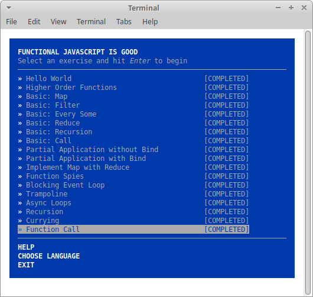
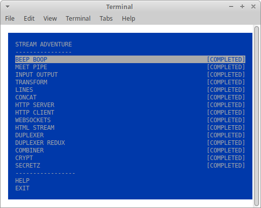

# kottans-backend
Wensday, the 11th of September, 2019  
My name is Ira Afanasieva  
**Task 1**. Git and GitHub - **is finished**  

## Unix Shell

Thursday, the 12th of September, 2019  
**Task 2.1 (codecademy)**. Learn the Command Line - **is finished**  
_what was new to me_: the **grep** command  
_what surprised me_: **wildcards** usage  
_what I intend to use in future_: linux shell  

  
  
  
 

**Task 2.1 (linuxsurvival)**. Linux Survival - **is finished**   
_what was new to me_: nothing  
_what surprised me_: nothing  
_what I intend to use in future_: linux shell  

  
  
  
  

Sunday, the 15th of September, 2019  
**Task 2.2 (linuxcommand)**. Learning the Shell - **is finished**  
_what was new to me_: the **expantion** chapter  
_what surprised me_: the **expantion** capability  
_what I intend to use in future_: the **expantion** chapter  

  
The **expantion** chapter is quite **useful**  
A **disadvantage** is a **longread** tutorial form  

## Git Collaboration

Sunday, the 15th of September, 2019  
**Task 3.1 (udacity)**. Version Control with Git - **is finished**  
_what was new to me_: git options usage  
_what surprised me_: graph option  
_what I intend to use in future_: **git** for version control  

  

Tuesday, the 17th of September, 2019  
**Task 3.2 (udacity)**. GitHub & Collaboration - **is finished**  
_what was new to me_: explanation of `origin` and `upstream` aliases  
_what surprised me_: the `--grep` option pretty the same as the `grep` command in linux shell  
_what I intend to use in future_: **gitHub** for repositories store  

  

## NodeJS Basics 1

Friday, the 20th of September, 2019  
**Task 4.1 (learnyounode)**. Learn You The Node.js For Much Win! **is finished**  
_what was new to me_: everything  
_what surprised me_: nothing  
_what I intend to use in future_: node.js  

  

Monday, the 23th of September, 2019  
**Task 4.2 (functionaljavascript)**. Functional Javascript Workshop **is finished**  
_what was new to me_: everything  
_what surprised me_: nothing  
_what I intend to use in future_: node.js  

  

Tuesday, the 24th of September, 2019  
**Task 4.3 (stream-adventure)**. Stream Adventure Workshop **is finished**  
_what was new to me_: stream capabilities  
_what surprised me_: nothing  
_what I intend to use in future_: stream capabilities  

  

## Memory Management

Thursday, the 26th of September, 2019  
**Task 5.1.** Anatomy of a Program in Memory **is finished**  
_what was new to me_: nothing  
_what surprised me_: nothing  
_what I intend to use in future_: knowledge of memory mapping  

**Task 5.2.** Discover memory mapping on real-life example **is finished**  
_what was new to me_: pseudo-files system **proc**  
_what surprised me_: nothing  
_what I intend to use in future_: pseudo-files system **proc**  

**Task 5.3.** Understanding Garbage Collection and Hunting Memory Leaks in Node.js **is finished**  
_what was new to me_: V8 uses two types of garbage collection: **Scavenge**: fast but incomplete; **Mark-Sweep**: relatively slow but frees all non-referenced memory  
_what surprised me_: V8 is written in C++  
_what I intend to use in future_: https://github.com/bretcope/node-gc-profiler  

- What's going to happen if program reaches maximum limit of stack ?  *We have a stack overflow and the program receives a Segmentation Fault*  
- What's going to happen if program requests a big (more then 128KB) memory allocation on heap ?  *In Linux, if you request a large block of memory via malloc(), the C library will create an anonymous mapping instead of using heap memory.*  
- What's the difference between Text and Data memory segments ?  *Text memory segments (read and execute): stores strings and all code, writes to this area earn a program a Segmentation Fault. Data memory segments (read and write): holds the contents for static variables initialized in source code*  

```md
556f931b0000-556f931e4000 r-xp 00000000 fd:00 2753976                    /usr/bin/xfce4-terminal
556f933e4000-556f933e7000 r--p 00034000 fd:00 2753976                    /usr/bin/xfce4-terminal
556f933e7000-556f933e8000 rw-p 00037000 fd:00 2753976                    /usr/bin/xfce4-terminal
556f94236000-556f949ea000 rw-p 00000000 00:00 0                          [heap]
7fc64c2dd000-7fc64c2e2000 r-xp 00000000 fd:00 3016302                    /usr/lib/x86_64-linux-gnu/gdk-pixbuf-2.0/2.10.0/loaders/libpixbufloader-png.so
7fc650bb7000-7fc650bb8000 rw-p 00031000 fd:00 12976322                   /lib/x86_64-linux-gnu/libexpat.so.1.6.7
7fc650bb8000-7fc650c54000 r-xp 00000000 fd:00 2761902                    /usr/lib/x86_64-linux-gnu/libharfbuzz.so.0.10702.0
7fc650c54000-7fc650e54000 ---p 0009c000 fd:00 2761902                    /usr/lib/x86_64-linux-gnu/libharfbuzz.so.0.10702.0
7fc6523f9000-7fc6523fa000 rw-p 00035000 fd:00 2762120                    /usr/lib/x86_64-linux-gnu/libnettle.so.6.4
7fc6523fa000-7fc65240b000 r-xp 00000000 fd:00 2762398                    /usr/lib/x86_64-linux-gnu/libtasn1.so.6.5.5
7fc65240b000-7fc65260b000 ---p 00011000 fd:00 2762398                    /usr/lib/x86_64-linux-gnu/libtasn1.so.6.5.5
7fc65260b000-7fc65260c000 r--p 00011000 fd:00 2762398                    /usr/lib/x86_64-linux-gnu/libtasn1.so.6.5.5
7fc65260c000-7fc65260d000 rw-p 00012000 fd:00 2762398                    /usr/lib/x86_64-linux-gnu/libtasn1.so.6.5.5
7fc65260d000-7fc652787000 r-xp 00000000 fd:00 2752920                    /usr/lib/x86_64-linux-gnu/libunistring.so.2.1.0
7fc652787000-7fc652987000 ---p 0017a000 fd:00 2752920                    /usr/lib/x86_64-linux-gnu/libunistring.so.2.1.0
7fc652987000-7fc65298a000 r--p 0017a000 fd:00 2752920                    /usr/lib/x86_64-linux-gnu/libunistring.so.2.1.0
7fc65298a000-7fc65298b000 rw-p 0017d000 fd:00 2752920                    /usr/lib/x86_64-linux-gnu/libunistring.so.2.1.0
7fc65298b000-7fc6529a7000 r-xp 00000000 fd:00 2761950                    /usr/lib/x86_64-linux-gnu/libidn2.so.0.3.3
7fc6529a7000-7fc652ba6000 ---p 0001c000 fd:00 2761950                    /usr/lib/x86_64-linux-gnu/libidn2.so.0.3.3
7fc652ba6000-7fc652ba7000 r--p 0001b000 fd:00 2761950                    /usr/lib/x86_64-linux-gnu/libidn2.so.0.3.3
7fc652ba7000-7fc652ba8000 rw-p 0001c000 fd:00 2761950                    /usr/lib/x86_64-linux-gnu/libidn2.so.0.3.3
7fc652ba8000-7fc652cc2000 r-xp 00000000 fd:00 2762172                    /usr/lib/x86_64-linux-gnu/libp11-kit.so.0.3.0
7fc652cc2000-7fc652ec2000 ---p 0011a000 fd:00 2762172                    /usr/lib/x86_64-linux-gnu/libp11-kit.so.0.3.0
7fc652ec2000-7fc652ecc000 r--p 0011a000 fd:00 2762172                    /usr/lib/x86_64-linux-gnu/libp11-kit.so.0.3.0
7fc652ecc000-7fc652ed6000 rw-p 00124000 fd:00 2762172                    /usr/lib/x86_64-linux-gnu/libp11-kit.so.0.3.0
7fc652ed6000-7fc652ed7000 rw-p 00000000 00:00 0 
7fc652ed7000-7fc652edc000 r-xp 00000000 fd:00 2761293                    /usr/lib/x86_64-linux-gnu/libXdmcp.so.6.0.0
7fc652edc000-7fc6530db000 ---p 00005000 fd:00 2761293                    /usr/lib/x86_64-linux-gnu/libXdmcp.so.6.0.0
7fc6530db000-7fc6530dc000 r--p 00004000 fd:00 2761293                    /usr/lib/x86_64-linux-gnu/libXdmcp.so.6.0.0
7fc6530dc000-7fc6530dd000 rw-p 00005000 fd:00 2761293                    /usr/lib/x86_64-linux-gnu/libXdmcp.so.6.0.0
7fc65be0f000-7fc65be12000 r--s 00000000 fd:00 262508                     /var/cache/fontconfig/e13b20fdb08344e0e664864cc2ede53d-le64.cache-7
7fc65be12000-7fc65be19000 r--s 00000000 fd:00 3016285                    /usr/lib/x86_64-linux-gnu/gconv/gconv-modules.cache
7fc65be19000-7fc65be22000 r--p 00000000 fd:00 3934915                    /usr/share/icons/Adwaita/icon-theme.cache
7fc65be22000-7fc65be2b000 r--p 00000000 fd:00 3934915                    /usr/share/icons/Adwaita/icon-theme.cache
7fc65be2b000-7fc65be32000 r--p 00000000 fd:00 3932945                    /usr/share/icons/hicolor/icon-theme.cache
7fc65be32000-7fc65be39000 r--p 00000000 fd:00 3932945                    /usr/share/icons/hicolor/icon-theme.cache
7fc65be39000-7fc65be50000 r--p 00000000 fd:00 3932917                    /usr/share/icons/gnome/icon-theme.cache
7fc65be50000-7fc65be67000 r--p 00000000 fd:00 3932917                    /usr/share/icons/gnome/icon-theme.cache
7fc65be67000-7fc65be9c000 r--p 00000000 fd:00 3943827                    /usr/share/icons/elementary-xfce/icon-theme.cache
7fc65be9c000-7fc65bed1000 r--p 00000000 fd:00 3943827                    /usr/share/icons/elementary-xfce/icon-theme.cache
7fc65bed1000-7fc65bedc000 r--p 00000000 fd:00 3943836                    /usr/share/icons/elementary-xfce-darker/icon-theme.cache
7fc65bedc000-7fc65befd000 rw-p 00000000 00:00 0 
7fc65befd000-7fc65bf62000 r--p 00000000 fd:00 4851721                    /usr/share/themes/Greybird/gtk-3.0/gtk.gresource
7fc65bf62000-7fc65bf8b000 rw-p 00000000 00:00 0 
7fc65bf8b000-7fc65bf8d000 r--s 00000000 fd:00 262480                     /var/cache/fontconfig/6afa1bb216ce958c1589e297e8008489-le64.cache-7
7fc65bf8d000-7fc65bf91000 r--p 00000000 fd:00 3943832                    /usr/share/icons/elementary-xfce-dark/icon-theme.cache
7fc65bf91000-7fc65bf95000 r--p 00000000 fd:00 3943832                    /usr/share/icons/elementary-xfce-dark/icon-theme.cache
7fc65bf95000-7fc65bfa0000 r--p 00000000 fd:00 3943836                    /usr/share/icons/elementary-xfce-darker/icon-theme.cache
7fc65bfa0000-7fc65bfa1000 r--p 00000000 fd:00 4457544                    /usr/share/locale-langpack/en/LC_MESSAGES/gtk30.mo
7fc65bfa1000-7fc65bfa2000 r--p 00027000 fd:00 12980893                   /lib/x86_64-linux-gnu/ld-2.27.so
7fc65bfa2000-7fc65bfa3000 rw-p 00028000 fd:00 12980893                   /lib/x86_64-linux-gnu/ld-2.27.so
7fc65bfa3000-7fc65bfa4000 rw-p 00000000 00:00 0 
7ffdf8980000-7ffdf89a1000 rw-p 00000000 00:00 0                          [stack]
7ffdf89c2000-7ffdf89c5000 r--p 00000000 00:00 0                          [vvar]
7ffdf89c5000-7ffdf89c6000 r-xp 00000000 00:00 0                          [vdso]
ffffffffff600000-ffffffffff601000 r-xp 00000000 00:00 0                  [vsyscall]
```
_Memory Mapping Segment_, _Heap_ and _Stack_ fragments address: `Heap - 556f94236000-556f949ea000`, `Stack - 7ffdf8980000-7ffdf89a1000`, `MMS - 7fc650bb7000-7fc650bb8000`.

## TCP. UDP. Network

Thursday, the 3rd of October, 2019  
**Theory (khanacademy)**. Internet Intro - **is finished**  
_what was new to me_: nothing (have got some CCNA certificates...)  
_what surprised me_: there are only women in IT ))))  
_what I intend to use in future_: secure protocols for sure!  

  

## Relational Databases Basics  

Monday, the 16th of September, 2019  
**6.1. Theory (codecademy)**. SQL analyzing Business Metrics - **is finished**  
_what was new to me_: nothing  
_what surprised me_: nothing  
_what I intend to use in future_: relational DB  

  

**Practice**. Sql query: [select.sql](sql_basics/select.sql)  
_what was new to me_: nothing  
_what surprised me_: nothing  
_what I intend to use in future_: select syntax  