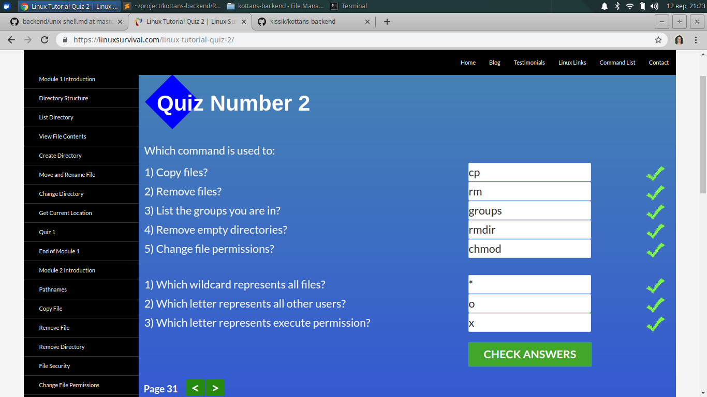
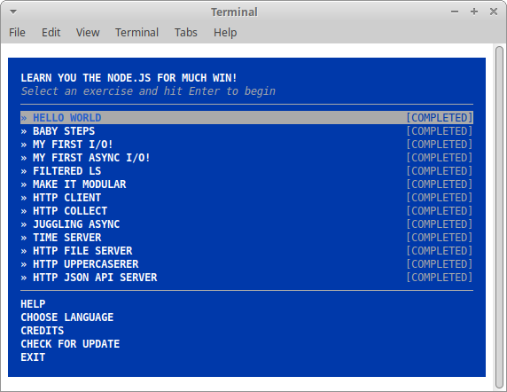

# kottans-backend
Wensday, the 11th of September, 2019  
My name is Ira Afanasieva  
**Task 1**. Git and GitHub - **is finished**  

## Unix Shell

Thursday, the 12th of September, 2019  
**Task 2.1 (codecademy)**. Learn the Command Line - **is finished**  
  
  
  
 

**Task 2.1 (linuxsurvival)**. Linux Survival - **is finished**   
  
  
  
  

Sunday, the 15th of September, 2019  
**Task 2.2 (linuxcommand)**. Learning the Shell - **is finished**  
  
The **expantion** chapter is quite **useful**  
A **disadvantage** is a **longread** tutorial form  

## Git Collaboration

Sunday, the 15th of September, 2019  
**Task 3.1 (udacity)**. Version Control with Git - **is finished**  
  

Tuesday, the 17th of September, 2019  
**Task 3.2 (udacity)**. GitHub & Collaboration - **is finished**  
  

## NodeJS Basics 1

Friday, the 20th of September, 2019  
**Task 4.1 (learnyounode)**. Learn You The Node.js For Much Win! **is finished**  
  

## Relational Databases Basics  

Monday, the 16th of September, 2019  
**Theory (codecademy)**. SQL analyzing Business Metrics - **is finished**  
  
**Practice**. Sql query: [select.sql](sql_basics/select.sql)